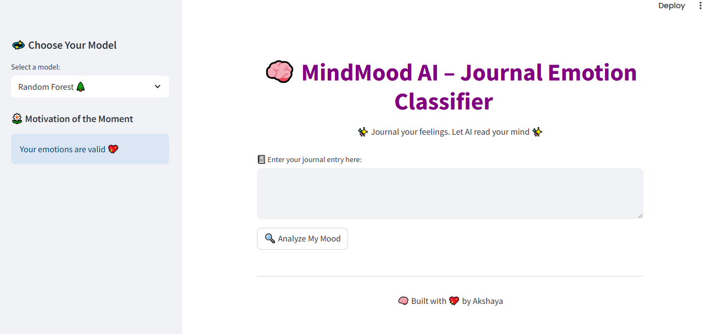
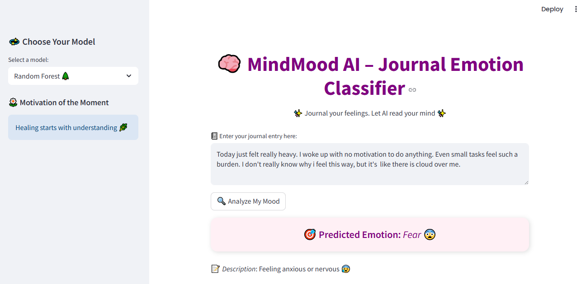
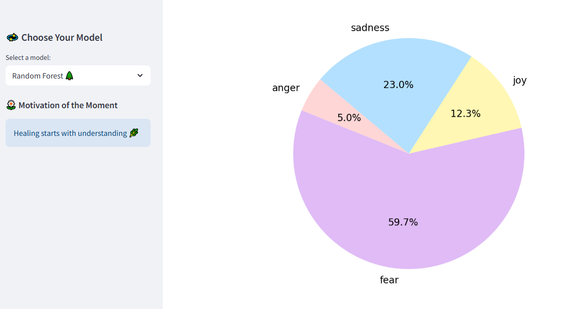

# 🧠 MindMood AI – Journal-based Emotion Classifier

*MindMood AI* is a smart journal-based emotion detection system built using machine learning and NLP.  
It helps users understand their emotional state by analyzing daily journal entries and classifying them into emotions like *joy, **sadness, **anger, **fear*, and more.
This project was built as a real-world mental health assistant — lightweight, beautiful, and intelligent.

## 💡 Key Features

- 📝 Accepts journal-style user input
- 🤖 Classifies emotions using a trained ML model
- 📊 Visualizes confidence scores using a pie chart
- 😄 Emoji-enhanced emotion display
- 📚 Custom emotion descriptions
- 💬 Motivational quote based on mood
- 🔁 Model selection dropdown (Logistic Regression, Naive Bayes, etc.)
- 🌈 Stylish, responsive, and colorful UI (Streamlit)
- 📁 Neatly organized project structure

## 🚀 Tech Stack Used

| Purpose               | Tools / Libraries               |
|------------------------|-------------------------------|
| Language               | Python                         |
| Web App                | Streamlit                      |
| NLP & ML               | NLTK, Scikit-learn             |
| Preprocessing          | Stopwords, Stemming, TF-IDF    |
| Model Training         | Logistic Regression            |
| Model Persistence      | Pickle (.pkl)                  |
| Deployment Ready       | Yes ✅                         |

## 📂 Dataset

- The dataset includes CSV files with journal-style text entries labeled with emotions.
- Files used:
  - emotion-labels-train.csv
  - emotion-labels-test.csv
  - emotion-labels-val.csv
    
## 🖼️ Screenshots

### 🏠 Home Page


### 💬 Emotion Prediction


### 📊 Confidence Pie Chart


## 📁 Folder Structure

```bash
MindMood-AI/
├── app.py
├── data/
│   └── raw/
├── notebooks/
├── screenshots/
├── saved_model.pkl
├── vectorizer.pkl
├── README.md
└── ...
🙋‍♀️ About Me

Hi! I’m Akshaya R., an aspiring AI and data science enthusiast.
I’m currently building real-world, impactful solo projects to grow my skills and career.
This project is part of my journey to develop intelligent, human-centered AI solutions.
Let’s connect on LinkedIn!

⭐ If you liked this project, give it a ⭐ on GitHub!
